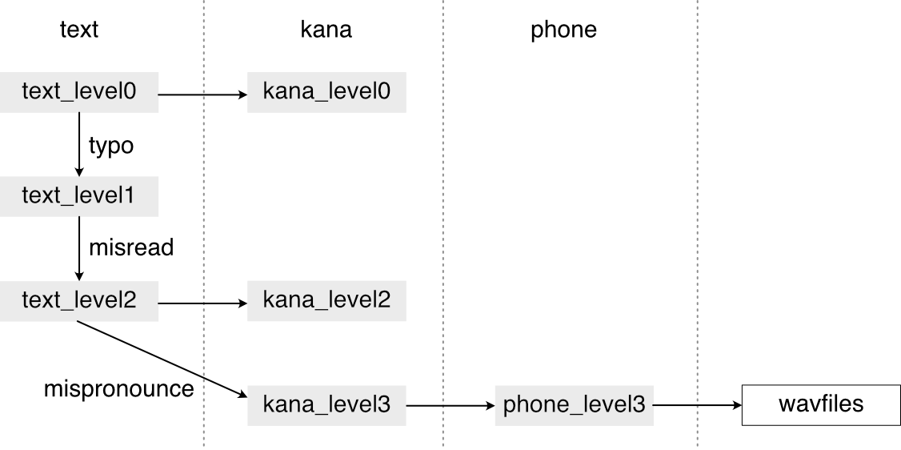

# Text-Kana labels

JSUT corpus includes mismatches between sentences and wavform files. This directory provides the gradual differences among some levels.
- text_level0: original sentences whose grammartical errors are modified
- kana_level0: hiragana characters (Japanese phonetic characters) corresponding to "text_level0". Cuerrentyly work-in-progress
- text_level1: original sentences of JSUT corpus
- text_level2: actually utterances sentences
- kana_level2: correct hiragana characters corresponding to the texts of "text_level2"
- kana_level3: hiragara characters that are actually uttered by the speaker. The ideographic commas ("，") represent pauses.
- phone_level3: phone sequences converted from "kana_level2"
